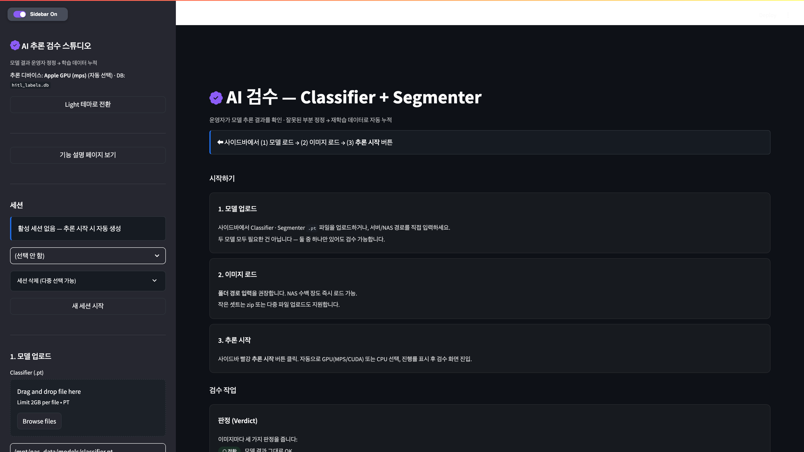
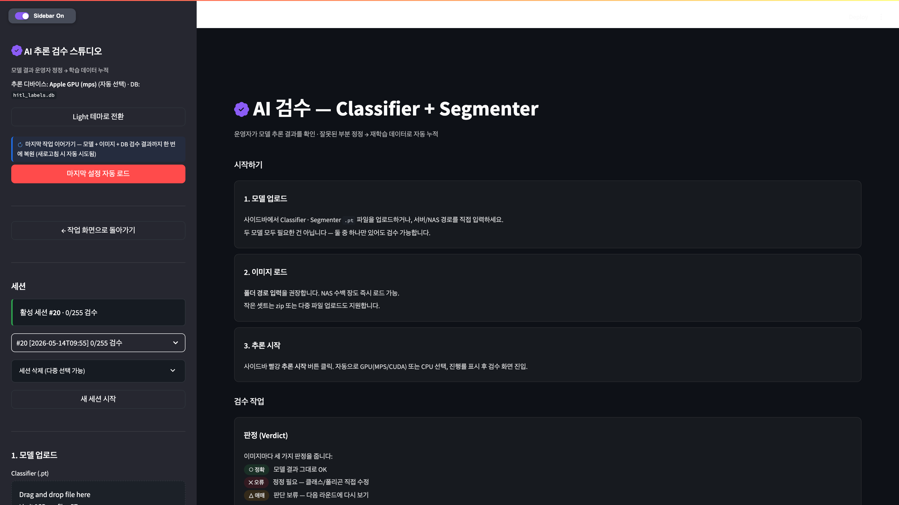
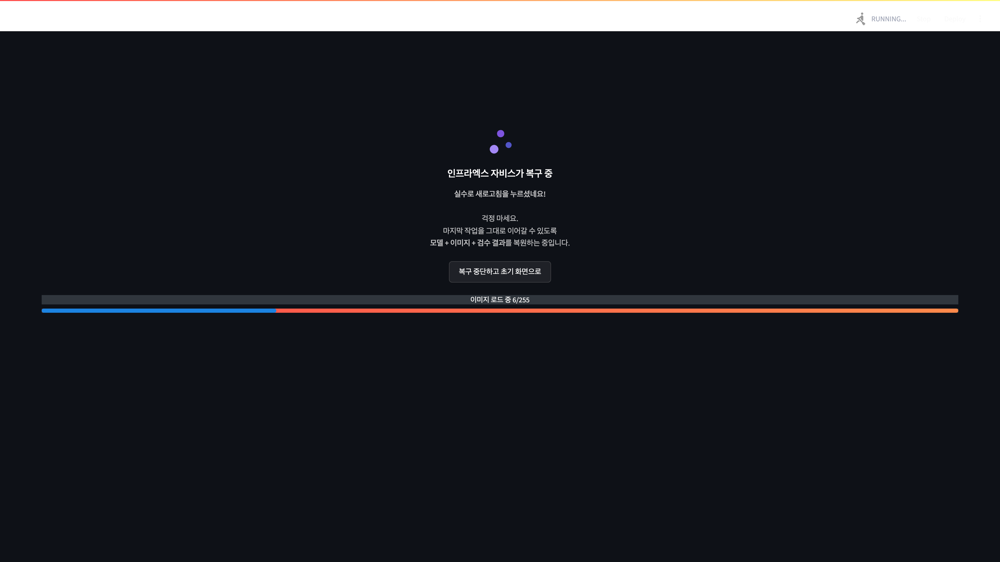
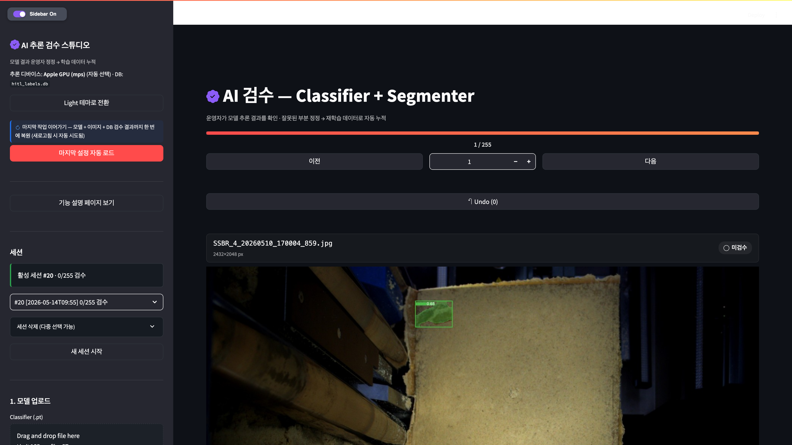
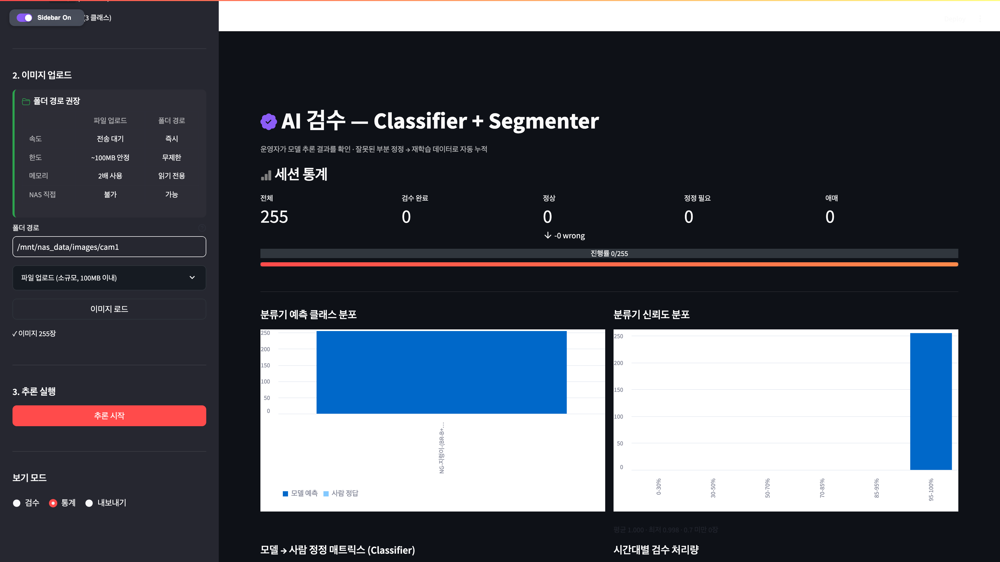
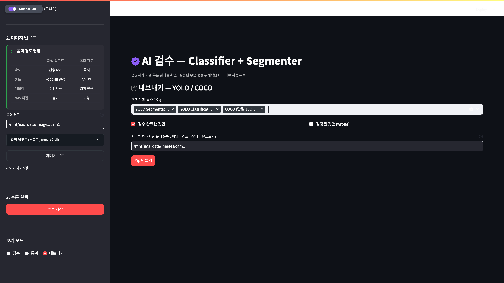
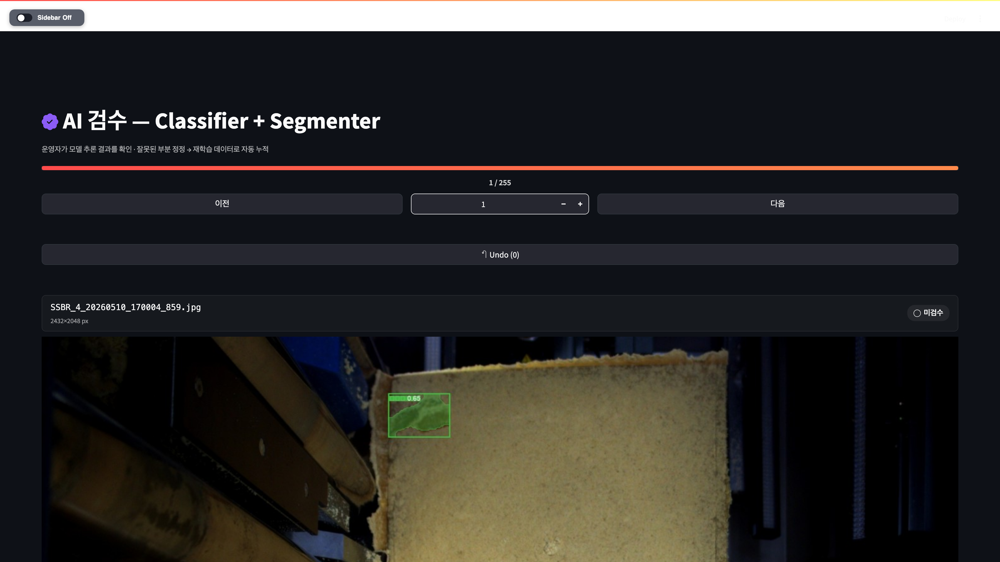

# AI 추론 검수 스튜디오

> 운영자가 AI 모델 (Classifier + Segmenter) 의 추론 결과를 직접 검수·정정하고, 정정된 결과를 학습 데이터로 자동 누적하는 Human-in-the-Loop (HITL) 시스템

YOLO (You Only Look Once) Classifier + YOLO Segmenter 두 모델이 출력한 결과를 운영자가 직관적인 UI 로 검수·정정하고, SQLite DB 에 라벨을 누적해 YOLO Segmentation / YOLO Classification / COCO (Common Objects in Context) 포맷으로 즉시 export 할 수 있습니다.

---

## 도입 효과

- **검수 속도 향상** — 모델 pre-annotation 을 시작점으로 사용해 처음부터 라벨링하는 것보다 운영자 작업 시간 단축
- **학습 데이터 누적 자동화** — 검수 결과를 별도 라벨링 도구 없이 즉시 재학습 입력으로 export
- **단일 도구로 완결** — 추론 → 검수 → export 전체 사이클을 하나의 웹 UI 에서 처리
- **HITL 원칙 적용** — 모델 출력에 대한 사람의 최종 판단 + 정정 기록이 다음 학습의 입력으로 순환

---

## 핵심 특징

- **자동 복구** — 새로고침·브라우저 종료·다음 날 재접속 시 모델 + 이미지 + 검수 진행률 자동 복원, 마지막 미검수 이미지로 자동 점프
- **자체 빌드 폴리곤 에디터** — Konva.js + React 기반. 정점 추가·삭제·이동·새 영역 그리기 지원
- **단일 zip export** — YOLO Seg / YOLO Cls / COCO 3종 동시 생성. 검수 완료 항목만 필터 가능
- **Light / Dark 테마** — 사용자 선택 영속화
- **다중 세션 관리** — 작업 단위로 세션 자동 생성, 이어가기, 다중 선택 삭제

---

## 화면별 스크린샷

> 모든 화면이 **Light / Dark 테마 양쪽** 으로 작동합니다. 사이드바 상단 "테마 전환" 버튼 한 번 클릭으로 즉시 변경되며, 선택은 영구 저장됩니다. 아래 스크린샷은 Dark 모드 기준.

### 1. 메인 페이지 + 기능 안내

처음 진입 시 (모델·이미지 로드 전) 또는 검수 도중 사이드바 **"기능 설명 페이지 보기"** 토글로 언제든 같은 안내 카드를 볼 수 있습니다. 시작하기 / 검수 작업 / 자동 복구 / 단축키 등 전체 흐름이 한 페이지에 정리.

**A) 처음 진입 시 (모델 로드 전):**



**B) 검수 도중 사이드바 토글:**



두 경우 모두 **동일한 안내 카드** — 처음 사용자도 이 페이지만 보면 전체 흐름 이해 가능.

### 2. 자동 복구 — 인프라엑스 자비스 복구 페이지

새로고침 시 마지막 모델 + 이미지 + 검수 결과를 자동 복원. 멈춘 것 같으면 "복구 중단하고 초기 화면으로" 버튼으로 탈출.



### 3. 검수 작업 화면

추론 완료 후 진입. 상단 헤더 카드 (파일명·해상도·상태 배지) + 폴리곤 편집 캔버스 + Classifier 검수 + Segmenter 검수 패널 + Save + 다음 버튼.



### 4. 통계 대시보드

검수 진행률, verdict (정확 / 오류 / 애매) 분포, 클래스별 통계, 시간 흐름 그래프.



### 5. 내보내기 (Export)

YOLO Segmentation / YOLO Classification / COCO 3종 포맷 동시 생성. 검수 완료한 것만 필터 가능. 단일 zip 다운로드 + 서버측 저장 옵션.



### 6. 사이드바 접힌 상태

검수 작업에 집중할 때 사이드바를 접어 메인 영역 확대. 좌측 상단 Sidebar 스위치 클릭.



---

## 사용 흐름

### A. 처음 시작 (새 작업)

```text
1. 사이드바에서 Classifier / Segmenter 모델 경로 입력  → 모델 로드
2. 이미지 폴더 경로 입력  → 이미지 로드
3. 추론 시작 (빨강 버튼)  → 약 60초 대기 (255장 기준, Apple M1 MPS)
4. 검수 화면 자동 진입
5. 각 이미지마다 ○✕△ 판정 + 필요시 폴리곤·클래스 정정 → 저장+다음
```

### B. 작업 이어가기 (다음 날)

```text
1. Streamlit 재시작 후 브라우저 진입
2. 자비스 복구 화면 (자동 회전 로딩)
3. 모델 + 이미지 + DB 검수 결과 자동 복원
4. 마지막 미검수 이미지 위치로 자동 점프
```

### C. Export — 학습 데이터 생성

```text
1. 사이드바 보기 모드 → 내보내기 선택
2. 포맷 선택 (YOLO Seg / Cls / COCO — 기본 3종 모두)
3. "검수 완료한 것만" 필터 (기본 ON)
4. Zip 만들기 → 브라우저 다운로드
```

### D. 새 데이터셋으로 전환

```text
1. 사이드바 새 세션 시작  → 모든 경로·세션·메모리 완전 초기화
2. 새 폴더 경로 입력  → 추론 시작 → 새 session_id 자동 생성
```

---

## 사이드바 위젯 가이드

| 위젯 | 역할 |
|---|---|
| **Light / Dark 테마 전환 버튼** | 테마 즉시 전환. `.last_config.json` 에 저장되어 새로고침 후에도 유지 |
| **마지막 설정 자동 로드** (빨강) | 클릭 시 메인 영역에 자비스 복구 페이지 표시, 빠른 수동 복구 |
| **기능 설명 페이지 보기 / 작업 화면으로 돌아가기** | 안내 카드 ↔ 검수 화면 자유 전환 |
| **세션 selectbox** | 이전 세션 이어서 진행 |
| **세션 삭제 (다중 선택)** | 여러 세션을 한 번에 삭제 |
| **새 세션 시작** | 완전 초기화 (경로·모델·세션 모두 리셋) |
| **Classifier / Segmenter 경로 + 모델 로드** | NAS (Network Attached Storage, 사내 공유 저장소) 경로 직접 입력 권장 |
| **폴더 경로 + 이미지 로드** | 폴더 안 모든 jpg / jpeg / png 재귀 로드. NAS 직접 접근 가능 |
| **추론 시작** (빨강) | 자동 GPU/MPS/CPU 선택. 진행률 표시 |
| **보기 모드 라디오** | 검수 / 통계 / 내보내기 — 추론 후 활성 |
| **검수 옵션** | 정렬 (입력순/신뢰도/Active Learning) + 폴리곤 ROI 크롭 뷰 |

---

## 단축키

| 키 | 동작 |
|---|---|
| **← / →** | 이전 / 다음 이미지 (Windows / macOS 공통) |
| **Ctrl + S** (Windows) / **⌘ Cmd + S** (macOS) | 저장 + 다음 이미지로 이동 |
| **Ctrl + Z** (Windows) / **⌘ Cmd + Z** (macOS) | Undo — 현재 이미지 직전 상태로 복귀 |

> Input 필드에 포커스가 있을 때는 단축키가 텍스트 입력으로 작동합니다. 빈 영역을 클릭한 뒤 사용하세요.

---

## 빠른 시작

### 1. 의존성 설치

```bash
cd hitl_prototype
pip install -r requirements.txt
```

> Python 3.10 이상 권장. ultralytics, streamlit, pillow, streamlit-drawable-canvas 등이 자동 설치됩니다. PyTorch 설치는 환경에 따라 수 분~수십 분 소요될 수 있습니다.

### 2. 실행

```bash
streamlit run app.py --server.port=8501
```

브라우저에서 `http://localhost:8501` 자동 오픈.

### 3. macOS 에서 NAS 폴더 접근

NAS 경로 (`/Volumes/...`) 사용 시 Terminal.app 에 **전체 디스크 접근 권한** 부여 필요:

1. 시스템 설정 → 개인정보 보호 및 보안 → 전체 디스크 접근 권한
2. `+` 클릭 → `Terminal.app` (또는 사용 중인 터미널) 추가
3. 해당 Terminal 에서 `streamlit run app.py` 실행

### 4. Windows 에서 NAS 폴더 접근

Windows 운영자는 네트워크 드라이브 매핑 후 사용:

```text
1. 파일 탐색기 → 내 PC → 네트워크 드라이브 연결
2. \\nas-server\share 형식으로 매핑 (예: Z 드라이브)
3. 폴더 경로 입력란에 Z:\images 같이 매핑된 경로 입력
```

### 5. Custom Component (폴리곤 에디터) 재빌드 (선택)

폴리곤 편집기 (React/Konva.js) 의 소스 수정 시만 필요:

```bash
cd polygon_editor/frontend
npm install --legacy-peer-deps
npm run build
```

> 일반 사용자는 빌드된 `dist/` 가 이미 포함되어 있어 별도 작업 불필요.

---

## 데이터 보관

### SQLite DB (`hitl_labels.db`)

| 테이블 | 설명 |
|---|---|
| `sessions` | 작업 단위. classifier / segmenter / folder path + 시작 시각 |
| `labels` | 이미지별 모델 추론 결과 + 사람 정정 verdict + 정정된 polygon/class |
| `label_history` | 검수 동작 이력 (저장 / 변경 / Undo 추적) |

DB 파일은 `.gitignore` 처리. 운영자 PC 별 별도 보관.

### `.last_config.json` (사용자 설정)

```text
저장 항목: classifier 경로 / segmenter 경로 / 이미지 폴더 경로 / 활성 session_id / 테마 선택
```

> **주의**: 다른 PC 로 옮길 때는 `hitl_labels.db` + `.last_config.json` 두 파일을 함께 복사하되, **NAS 마운트 경로가 동일해야 자동 복구가 정상 동작**합니다. 경로가 다르면 사이드바에서 수동으로 새 경로 입력 필요.

### Export Zip 구조

#### 단일 포맷 선택 시 (예: YOLO Segmentation)

```text
export_meta.json    # session_id, 생성 시각, 검수 통계
labels/             # YOLO seg txt (class_id + normalized polygon)
images/             # 원본 이미지 카피
data.yaml           # 클래스 정의 (id → name)
weights.csv         # 이미지별 정정 가중치 (재학습 시 강조 배율)
```

#### 3종 포맷 동시 선택 시

```text
export_meta.json
yolo_segment/       # 위 YOLO Seg 구조 그대로
yolo_classify/      # YOLO 분류 폴더 구조 (클래스별 하위 폴더) + README.md
coco/               # COCO 단일 JSON + images/
```

---

## 아키텍처

```text
hitl_prototype/
├── app.py                  # Streamlit 메인 — 사이드바·메인 페이지 라우팅 (~2300 줄)
├── labeling.py             # 검수 UI 컴포넌트 (verdict 버튼, 폴리곤 카드, segmenter 패널)
├── db.py                   # SQLite 스키마 + CRUD (labels, label_history, sessions)
├── inference.py            # YOLO 모델 로드 + classifier/segmenter 추론
├── export.py               # YOLO Seg/Cls + COCO 포맷 zip 생성
├── labelstudio_bridge.py   # Label Studio 외부 도구 연동 — 프로젝트 생성 / task import / annotation export
├── polygon_editor/         # 자체 Streamlit Custom Component
│   ├── __init__.py         # Python wrapper (_RELEASE=True → dist 사용)
│   └── frontend/           # Vite + React 18 + TypeScript + Konva.js
│       ├── src/App.tsx     # 폴리곤 에디터 본체 (~900 줄)
│       └── dist/           # 빌드 산출물 (커밋 포함)
├── .streamlit/config.toml  # 업로드 한도 등
├── docs/screenshots/       # 화면 캡처
└── requirements.txt
```

---

## 알려진 제한사항

| 항목 | 제한 |
|---|---|
| **동시 검수 사용자** | 현재 **단일 사용자 전용**. SQLite single-writer 구조라 다중 사용자 동시 검수 시 DB lock 충돌 가능. 회사 서버 배포 시 PostgreSQL 전환 필요 |
| **메모리 사용량** | 이미지 1000장 이상 시 사이드바 자동 복구가 RAM 4GB+ 소모. 대용량은 폴더 분할 권장 |
| **지원 모델 형식** | YOLO `.pt` (ultralytics 라이브러리 호환) 전용. ONNX / TorchScript 미지원 (확장 가능) |
| **지원 이미지 형식** | JPG / JPEG / PNG (PIL 로딩 가능한 형식만) |
| **테스트 환경** | macOS 14+ / Python 3.10~3.13 / Chrome·Safari 최신 / Streamlit 1.39 |
| **단축키 - 윈도우** | Chrome `Ctrl+S` 가 페이지 저장 다이얼로그를 가로채는 경우 있음. preventDefault 처리되었으나 브라우저별 차이 가능 |
| **오프라인 환경** | 일부 아이콘이 외부 CDN (Iconify) 에서 로드 → 사내 폐쇄망에서는 아이콘 깨짐 가능. 폐쇄망 배포 시 SVG 로컬 임베드 필요 |

---

## 회사 서버 배포 가이드

### 1. macOS Sandbox 이슈 → Linux 서버에서 사라짐

현재 macOS 에서는 NAS 폴더 listing 에 **전체 디스크 접근 권한** 필요. Linux 서버 배포 시 이 이슈 자체가 사라집니다.

### 2. 추론 가속 옵션

| 옵션 | 추천도 | 비고 |
|---|---|---|
| GPU (NVIDIA + CUDA) | ★★★ 가장 빠름 | 대량 배치, 24시간 운영 권장 |
| Hailo NPU / 엣지 가속기 | ★★ 저전력 | 별도 모델 컴파일 필요 |
| Apple MPS | ★ 개발용 | Mac local 만 |
| CPU only | 비추 | 255장 약 10분+ |

CUDA 사용 시 `pip install torch torchvision --index-url https://download.pytorch.org/whl/cu121` (CUDA 버전 맞춰서).

### 3. 다중 사용자 동시 검수 → DB 전환 필수

| 변경 항목 | 권장 방법 |
|---|---|
| SQLite → **PostgreSQL** | `db.py` 의 `sqlite3` 호출을 `psycopg2` 또는 `asyncpg` 로 교체. 테이블 스키마는 그대로 |
| 또는 사용자별 file-based DB | 각자 `hitl_labels_{user_id}.db` |
| 세션 격리 | `session_id` 에 `user_id` 컬럼 추가, 라벨 조회 시 user 필터 |

### 4. 인증 / 권한 — 옵션 비교

| 방법 | 장점 | 단점 |
|---|---|---|
| 사내 SSO (Keycloak / Okta) | 기존 사내 계정 재사용, 감사 로그 통합 | 초기 통합 작업 (1~3일) |
| OAuth (Google / Microsoft) | 빠른 셋업 | 외부 IdP 의존 |
| BasicAuth (Nginx reverse proxy) | 즉시 적용 | 사용자별 권한 분리 어려움 |
| Streamlit Cloud Auth | 0-config | Streamlit Cloud 배포 시만 |

### 5. 컨테이너 배포 (Docker 권장)

```dockerfile
# Dockerfile
FROM python:3.11-slim
WORKDIR /app
COPY requirements.txt .
RUN pip install --no-cache-dir -r requirements.txt
COPY . .
EXPOSE 8501
CMD ["streamlit", "run", "app.py", "--server.port=8501", "--server.address=0.0.0.0"]
```

```yaml
# docker-compose.yml
services:
  hitl:
    build: .
    ports:
      - "8501:8501"
    volumes:
      - /mnt/inspection_data:/mnt/inspection_data:ro  # NAS 마운트 read-only
      - ./data:/app/data                              # DB / 설정 영속화
    environment:
      - TZ=Asia/Seoul
```

### 6. NAS 마운트 (Linux fstab)

```text
//nas-server/share /mnt/inspection_data cifs credentials=/etc/samba/credentials,uid=1000,gid=1000,ro 0 0
```

> **보안 경고**: `password=...` 를 fstab 에 직접 적으면 `/etc/fstab` 파일에 평문으로 노출됩니다 (`/etc/fstab` 은 시스템 모든 사용자가 읽기 가능).
>
> 반드시 별도 credentials 파일 사용:
>
> ```bash
> # /etc/samba/credentials  (chmod 600 — root 만 읽기)
> username=svc-inspection
> password=********
> ```
>
> ```bash
> sudo chmod 600 /etc/samba/credentials
> ```
>
> `ro` (read-only) 옵션으로 운영자가 실수로 NAS 원본을 수정·삭제하는 사고를 방지하세요.

### 7. 모니터링 / 로깅

| 항목 | 도구 |
|---|---|
| Streamlit 로그 | `--logger.level=info` + `journalctl` 또는 stdout 캡처 |
| 검수 통계 추적 | DB → Grafana / Metabase 대시보드 |
| 알람 | 검수 정체 시 Slack / Teams webhook |

### 8. 보안 권장사항

- NAS 마운트는 반드시 `ro` (read-only) 옵션
- export zip 다운로드 경로 sandboxing (`/tmp/exports/`)
- secrets 는 환경변수 또는 Streamlit secrets (`.streamlit/secrets.toml`)
- 운영자 PC 의 `.last_config.json` 은 NAS 경로 포함 → 외부 공유 금지

---

## 트러블슈팅

| 증상 | 원인 / 해결 |
|---|---|
| NAS 경로 입력해도 "이미지 0장" | macOS Full Disk Access 권한 미부여 → Terminal.app 추가 후 streamlit 재시작 |
| 자동 복구 화면이 멈춤 | 주소창에 `?skip_auto=1` 추가 후 새로고침 → 빈 상태로 진입 → 사이드바에서 수동 작업 |
| 모델 로드 "Operation not permitted" | 위와 동일 — 권한 이슈 |
| 폴리곤 편집기 색이 안 맞음 | 강제 새로고침 (macOS: `⌘+Shift+R` / Windows: `Ctrl+Shift+R`) — streamlit / 브라우저 캐시 일소 |
| 검수 결과를 다른 PC 에서 이어가고 싶음 | `hitl_labels.db` + `.last_config.json` 두 파일 복사 (NAS 마운트 경로 동일해야 자동 복구 동작) |
| 단축키 작동 안 함 | input 필드에 포커스 있을 때 — 빈 영역 클릭 후 재시도 |
| 아이콘 깨짐 (네모로 표시) | 외부 CDN (Iconify) 차단된 폐쇄망 환경 — IT 담당자에게 `api.iconify.design` 허용 요청 또는 SVG 로컬 임베드 |

---

## 라이선스 / 사용 범위

**Proprietary — All Rights Reserved.**
© (주)인프라엑스 내부 운영 도구. 본 레포는 회사 공유 목적으로 공개되어 있으나 **오픈소스가 아니며**, 코드·문서·이미지의 무단 복제 / 재배포 / 상업적 사용을 일체 금지합니다.

- 본 도구 사용·기여·문의는 (주)인프라엑스 소속 또는 협력 관계자에 한정됩니다.
- 외부 공유·발표 시 사전 승인 필요.
